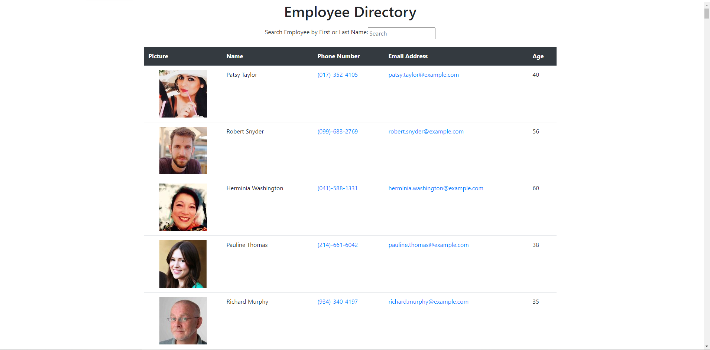

# Progressive Budget Tracker

  
## Description 
This application has been created with an random user API to compile a faux employee directory using React. The application has been split up into three components to display the image, name, phone number, email address, and age of each 'employee'. 

## Table of Contents 
* [Installation](#Installation)
* [Usage](#Usage)
* [Technologies](#Technologies)
* [License](#License)
* [Contributing](#Contributing)
* [Tests](#Tests)
* [Visuals](#Visuals)
* [Links](#Links)
* [Questions](#Questions)

## Installation
1. Use 'git clone git@github.com:kbnewlon/employee-directory.git' to clone the repo
2. Install necessary dependencies with 'npm install'
3. Start the program with 'npm start' or 'node server.js'
4. Enjoy!

## Usage
1. The user can search the employee directory by first or last name in the input field
2. The user can click 'name' to alphabetize by first name

## Technologies
* [Random User API](https://randomuser.me/api/?results=200&nat=us)
* HTML
* CSS 
* JavaScript
* Axios 
* React.js
* Bootstrap 

## License
Copyright (c) 2020, Kayla Newlon. (MIT License)

## Contributing 
N/A 

## Tests
N/A

## Visuals

## Links
To Repo: https://github.com/kbnewlon/employee-directory
 Visit the deployed app on Heroku to demo: https://kbn-employee-directory.herokuapp.com/
 

## Questions 
Please contact me if you have any questions at:
 Email: kayla.b.newlon@gmail.com
 Github: https://github.com/kbnewlon